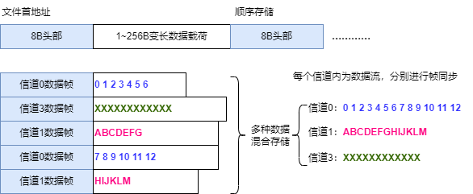
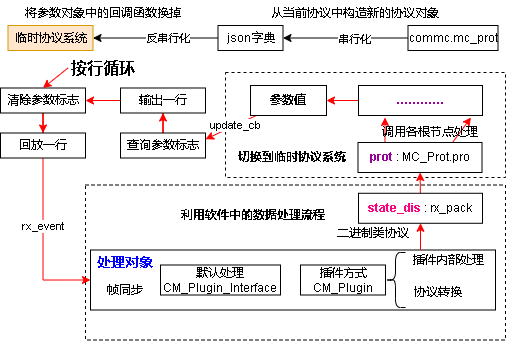

<link rel="stylesheet" type="text/css" href="base.css">

2日志与回放设计
====== 
[TOC]
## 日志记录与回放
### 日志分类
软件可将上行数据保存成文件，形成日志记录。其中文本的数据存放在带时间戳的文本文件中，二进制数据存放在cmlog格式混合日志文件的信道1中
日志文件分为3种：无时间戳文本，带时间戳文本，cmlog混合日志。
> - **原始数据 .org**
	无时间戳的数据直接存储，回放时，以最快的速度加载所有数据。所以曲线中的数据没有横坐标，需要在软件中通过指令配置横坐标的索引数据。 
> - **带时间戳文本 .ttlog**
	在每个文本协议行首加入"mmss.fff	"格式的时间戳（分秒.毫秒），tab分割。软件记录文本数据时使用此格式。
> - **cmlog混合日志 .cmlog**
	软件特有的日志格式，可由其他应用程序产生，通用测控软件读取。日志具有多个虚拟信道，可分别存储不同格式的日志。每个存储帧具有ms时间戳

记录日志的格式通过变量MainWindow的rec_mod（state_dis.cs中）来确定，定义为：0：不记录，1：原始数据记录，2：带时间戳文本，3：cmlog

### cmlog日志格式
cmlog为二进制外包装，内部为数据流，可存储任意结构的数据。分数据帧存储，数据帧内具有6Byte头部记录存储帧长，虚拟信道号、帧类型信息，用以从文件中解析各信道的数据流。
  
数据头格式如下，数据帧数据载荷最大长度65535字节，最大16个虚拟信道
```C++
#pragma pack(1)
typedef struct //8 Byte
{
	u8 syn; 	//0xA0 同步字
	u8 type		:1; //类型，0文本，1二进制
	u8 res		:3; //
	u8 vir		:4; //虚拟信道号（高4bit）
	u16 len; 	//本行数据长度
	u32 ms; 	//距离文件起始的ms数
} CMLOG_ROWHEAD; //混合日志行头
#pragma pack()
```
文件名中包含了本文件的记录起始时间，精确到秒。文件内部的记录帧只需记录在1小时以内的ms数。

为了方便记录，文本协议默认记录在0信道，二进制各根实体的数据按顺序从1信道开始记录。
### 记录流程
为了能够回放，日志的记录需要存储时间戳。而未经帧同步的数据难以加入时间戳，若按接收包加，则文本行可能被截断。所以日志的记录应该选在帧同步后  
文本格式/原始数据的记录使用LogFile rec_text，二进制记录使用cmlog格式，BinDataFile rec_bin_file。
在state_dis.cs中，rx_pack函数里，根据记录模式rec_mod进行记录。
### 回放结构
回放控制类DataSrc_replay是一个数据源类，在record.cs中定义。
> - open函数：分类打开数据文件，初步处理原始数据，形成易于访问的数据缓存
> - set_replay_pos函数设置回放位置
> - 支持suspend、resume、stop暂停、恢复、终止。

打开回放数据源后，会通过线程池提交回放线程任务。
回放数据源在打开时，加载文件的所有内容，并根据文件的类型进行解析，将时间戳、行信息存放在line_ms_list等变量中，用以回放。
  
其中回放的数据缓存为：
``` cs
byte[] 		org_data; //cmlog的原始数据记录
List<int> 	line_ms_list; //每一行的ms间戳
List<string> 	data_lines; //文本格回放数据缓存，若是二进制，则为hex显示数据
List<CMLOG_HEAD> line_cmlog_list; //cmlog的每一行的头
List<byte[]>	 bin_lines; //回放数据存(二进制)
```
回放数据源需要打开文件选择对话框，而界面相关功能不是回放业务的职责，所以在state_dis.cs中建立了DataSrc_replay_filedlg，进行适配。

回放对话框replay_window.xaml.cs仅实现交互控制逻辑，所有回放逻辑都在record.cs中实现。
### 回放流程
回放流程在回放线程中，流程通过状态机实现，状态变量为：state，0终止，1暂停，2回放，3单步
  
回放线程调用**try_to_play**函数实现回放，**try_to_play**内部会判断当前回放行的ms数与回放时刻，决定是否回放，一次调用会回放所有小于回放时刻的行。
**replay_run_1_frame**为回放一帧数据的函数。
回放过程中，可通过**set_replay_pos**设置回放位置，设置单位为行号。

回放的时间控制：
回放可选择不同的速度，回放原理是比较当前回放时刻（**replay_ms**）与各回放帧的ms时间戳，而**replay_ms**并不是以正常的时间速度增加的。
通过上次回放时间**pre_replay_ms**与当前时间的差，确定真实时间间隔，然后这个间隔乘以回放速度比例，得到回放时间增量，加到**replay_ms**上。
### 指定变量输出
回放数据的导出可通过回放的数据缓存，以及回放起止位置变量轻易的实现，但要实现指定变量的导出，就必须进行协议解析，完成解析后按指定的变量实现输出。
指定变量输出功能在回放对话框中以导出变量csv实现，回放对话框界面上会显示系统中的所有变量，通过CheckBox实现变量的选择，在**export_csv**函数中实现导出功能。
**export_csv**的流程如下：
  
输出时，首先输出csv行首，为每个变量的名称。且固定第一列为时间戳，单位ms。
### 日志数据导出
日志格式变换功能在record.cs: DataSrc_replay中实现。其类中定义export_org、export_cmlog、export_timetext函数，用于将当前选中的数据导出成不同的格式。由函数内部判断当前数据格式是什么。

由于原始数据回放是不经过回放流程的，所以这里当前数据类型都是带时间戳的文本或cmlog格式。
### 日志回放界面
回放界面有一个poll函数，由mainwindow以10Hz调用。用于刷新界面变量的值。分频至3.3Hz，在此将原始数据中的5行显示到原始数据文本框，每次都刷新，并不影响文本框的鼠标选择。
### 数据格式转换
在log_tools.cs：Log_Tools类中实现一系列数据格式转换功能。数据转换的参数输入使用通用对话框Com_Dlg来简化实现。
#### 导出成cmlog格式
#### 导出原始数据
#### 导出成ttlog格式
#### 将指定的参数导出成csv
#### cmlog修改基准时间戳
使用通用对话框Com_Dlg，加入TextBox来取得输入起始时间，单位ms。一次性读入所有数据，在写入过程中，每次只写一行。
#### hex原始数据转二进制
#### 二进制原始数据转文本
#### 原始数据转cmlog
#### cmlog文件合并
