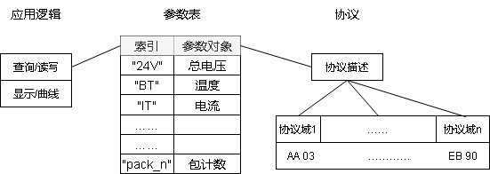
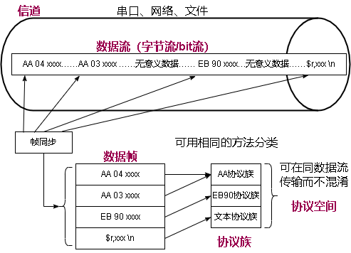
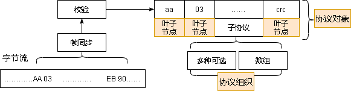
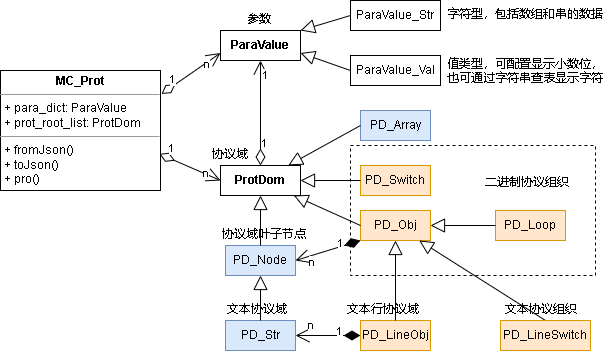

动态协议设计  
======  
## 动态协议需求  
### 系统集成需求
针对MCU测控应用场景，软硬件往往是通用的，而不是针对某一项目定制的。例如，PLC、canopen的测控模块等。这些设备的组合形成不同的测控系统  
对于一个系统，可能由多种配置方法，可以使用不同的设备实现同一参数的测控。这样就造成同一个参数有多种协议传输
针对此需求，可使用动态协议配置的方式满足。  
1. 动态协议配置是将测控所需的参数放在“参数数据库”中（例如canopen的对象字典，modbus的寄存器），测控逻辑在数据库中操作，协议对数据库进行读写，实现逻辑与协议分离。  
2. 通过协议的动态配置，实现不修改代码，仅修改配置就适配不同的协议。  
  
例如，在modbus中，只要设计确定了一个地址+寄存器的含义，主控就可以在此取得他想要的参数，而不管设备是如何实现的。即便购买了另一个厂家的设备，导致寄存器地址变更，也可以通过配置主控的方式（而不是修改主控代码），轻易的实现集成。
### 历史协议兼容需求
配置变更后，系统的二进制历史数据就只有老的程序才能打开，经过多次变更、软件升级后，历史数据基本无法使用了。
例如，一个系统中的实验数据非常宝贵，然而较长时间以前的实验数据是由老版本的程序产生的，其控制软件环境已经丢失，只有部分协议文档。为了能够读取这部分历史数据而特意编写旧协议的程序代价较大。

应建立各历史数据协议的配置文件，通过动态加载协议配置文件，在应用中更改协议的解析方法，从而实现对旧版本协议的解析。
### 协议可视化
动态协议配置必须实现可视化，才能真正用起来。通过json配置虽然能够从理论上实现协议的动态配置、参数的固定索引，但编写动态协议的json配置非常繁琐并且不够直观。实现可视化的动态协议配置是必须的途径。
## 动态协议概念设计  
### 概念定义
动态协议包括帧同步、参数、协议三部分，相关概念如下：
- **信道**：承载数据的容器，例如通信端口、文件
- **数据流**：具有顺序的一系列数据，在其中一定位置处包含有用数据，有用数据之间也可能填充了噪声等无意义数据
- **数据帧（包）**：具有一定结构的数据，可从中解析特定的信息
- **帧同步**：在数据流中提取有用数据帧，使接收解析与发送方同步，而排除数据帧之间的无意义数据的过程
- **协议空间**：一组能够通过协议中数据域区分开的协议构成一个协议空间。在一个协议空间中，要求设计的协议必须能通过某些数据特征区分不同的协议，若无法区分，就无法在同一数据流内混合传输。
- **协议族**：数据帧在协议空间中区分的过程中，可分为几个协议族，协议族中使用相同的方法进行帧类型分类。
  
- **参数**：是测控系统中的测量量，协议中的有意义数据
- **协议**：收发双方约定的数据结构，在数据帧中解析参数的方法。协议由协议域聚合而成。
### 数据帧同步
数据可通过同步头+校验的方式从数据流中确定一个数据帧的范围，例如二进制协议中通过包头、校验和的方式进行传输  
数据可通过帧尾同步的方式提取数据，例如文本行协议中，通过分行符和分列符实现数据分割。  
帧同步可首先实现一个通用版，通过配置实现大多数协议的同步，然后通过插件的方式实现特定协议的同步
一个协议空间中可能有多个同步头，对应多个协议族。按照当前帧同步的结构，需要有多个帧同步对象，当前可用先按单个来
### 参数  
参数是协议所承载的变量，作为解析的结果，类型包括：  
1. 数值：例如整数、浮点数  
2. 数组：例如字符串、二进制序列  
特殊的，当参数用于显示时，可以分为几类：  
1. 数组型，按字符串显示  
2. 数组型，未知格式，按hex显示  
3. 数值型，按配置的小数位数显示  
4. 数值型，按枚举字符串显示  
参数对于逻辑程序来说，可以使用指针访问，因为逻辑程序一定知道参数的类型。总结来说，可以按以上2类作为参数类的子类设计（数值、数组），并加入参数具体描述显示方式  
程序定义：  
数组类型的参数：ParaValue_Str  
数值类型的参数：ParaValue_Val  
对于用户来说，参数的全部类型包括：  
```  cs
public enum ParaType //参数类型
{
	u8, u16, u32, u64, //无符号整数
	s8, s16, s32, s64, //有符号整数
	f, df, //float、double
	undef, str, //未定义、字符串
}
```  
### 协议  
协议是数据帧中数据解析成参数值的方法，一个闭环的协议首先能在一个协议空间中区分不同的协议族，然后确定协议族内的数据帧类型，最后确定数据帧内部的所有协议域的值。
在数据流中区分协议族的工作是帧同步完成，协议部分处理是在一个协议族内部区分不同种类的协议帧
  
其中数据帧实体输入和分类过程中，二进制和文本分开考虑有助于提高文本协议的处理速度，所以协议的处理不是依据抽象原理统一处理，而是人工分类为文本和二进制两种，分别由不同的类进行处理。
#### 协议索引
协议域以及协议域组成的带有一定结构的协议对象均有唯一名称，由一个名称索引的协议域列表记录协议族中的所有协议域。复杂的协议通过名称引用基础协议。
协议的名称分为全局名和局部名，局部协议域通过上级协议的名称加"."作为前缀，在全局范围内访问。程序通过名称中是否具有"."来判断协议域是否在全局显示。即使是局部协议域，也可全局引用。
#### 聚合关系  
二进制协议族以树形结构划分各域，协议域的组织形式可以分为几种：  
1. obj：协议对象，一组顺序排列的协议域，只需记录子协议名称即可  
2. switch：选择节点，协议中的此域可以是不同的子协议，由选择节点确定具体是哪个子协议  
3. loop：重复域，表示此处有重复的对象，对象类型不必相同，对象个数可以指定  

协议树的组织根据这些对象关联的叶子节点的值来确定，例如，选择节点，引用协议中的类型数据，根据类型数值选择不同的协议；重复域，根据数据包中的某个数据，来确定重复次数。  
但是由于对象的引用只有一个，运算规则仅有线性运算，所以像modbus那样的协议就难以实现。除非做符号系统，实现更多的运算规则。  
对于复杂运算，还是用插件实现比较好。动态协议配置仅实现规则简单的协议。  

分行文本协议的组织是通过text协议对象实现，依据文本协议特有的命名（根据行首协议名+列数）确定本行的协议类型，并调用文本行协议域进行处理。
#### 叶子节点  
不同的数据域组织形式都只定义协议的树形结构，只有叶子节点是实体。  
叶子节点指明此数据域的输出参数索引，从协议中读数后，做相应的变换后再输出给参数。叶子节点可不指定输出参数，仅做占位  
协议中数据输入的类型包括：  
1. 二进制值类型：只需指定具体类型，即可取得值，并根据变换得到输出类型的值  
2. bit类型：影响在协议中的偏移增量，处理可按值类型处理  
3. 数组类型：包括字符串和未定义类型，可直接复制给输出参数  
4. 文本类型：需要从文本中提取值  
叶子节点可分为值、数组型2个子类，用具体类型区分处理。   
叶子节点根据输入类型和输出类型进行解析：  
> - 输入undef、字符串 输出是undef或者str 直接set_val的二进制接口  
> - 输入是字符串（10进制或hex） 输出是值 处理成double后变换，然后根据输出类型，构造对应的二进制数，若有浮点变整型，需要四舍五入，通过set_val二进制接口传出  
> - 输入二进制值 处理成对应的类型后变换，然后根据输出类型，构造对应的二进制数，若有浮点变整型，需要四舍五入，通过set_val二进制接口传出  
> - 输入是bit 处理成整数后变换，然后根据输出类型，构造对应的二进制数，若有浮点变整型，需要四舍五入，通过set_val二进制接口传出  
#### 通用文本行协议
使用类nmea协议的形式，作为上位机的标准协议，其他协议使用适配器来适配。例如，下位机使用二进制协议时，上位机通过C语言dll外扩适配器，将文本协议转换为二进制协议与下位机交互。所以，上位机只需实现通用文本协议即可实现所有测控协议需求。  
协议规定：  
> - 数据由文本组成，文本分行，行分列。  
> - 每一行数据可以是不同的数据包类型，通过列数量或第一列文本决定数据包类型  
> - 使用行（\n）作为数据包的分割，对于指令，使用空格或tab作为参数的分割符。对于测量变量，使用空格、逗号、tab作为分隔符  
> - 行首第一列可以作为普通数据，也可作为协议标志，以$开头，接接协议名称。  
例如：  
```  
    1 2 3 4 5 6 7      是一个7列数据，若系统中没有其他数据包是7列，则可以通过列数唯一确定这个数据包类型
    $r,OK              是一个2列数据，第一列以$开头，则“r”为协议名称，通过“r”确定这个数据包的类型
```  
规定：  
指令配置时，可通过写入\n来做多个指令  
'$'开头的是与插件或下位机约定的文本协议  
'^'开头的是软件自身控制协议：  
- ^clear         清除当前数据  
- ^x_axis 总电压 x轴的索引，只有收到此变量后才增加曲线x轴坐标，若为空，则使用时间ms数作为x轴  
### 实现  
测控体系实现由MC_Prot类组织，包含了：参数字典、二进制协议根对象、文本行协议字典 共3部分数据  
MC_Prot类负责初始化整个体系，接受数据输入。协议系统的类图如下：
  
协议域的实体对象组织方式，有两种方案：
1. 协议域实体由上层协议域所有
   协议域递归初始化，流程简单。但协议域难以复用，不利于图形编辑
2. 协议域实体由MC_Prot统一组织，协议树结构只引用协议域名称。
   协议域可复用，配置文件可读性强。所有协议域都必须显式指定名称。为了提高效率，需要在初始化完成后，再按唯一名称索引取得子协议域的引用
### 局限性
- 由于当前动态协议域的名称是局部名称，所以所有协议都必须在同一个根节点下定义。只有生成全局名称，才能实现协议的分批加载  
- 由于当前动态协议组织的参数引用只支持简单运算，所以不能支持复杂的变长包定义。只有建立符号系统，定义协议中各项参数的宏，才能实现任意变长包的解析  
- 不能根据不同设备id，区分不同设备中的相同参数。如果读入各设备混合的数据，则会将各设备的参数混为一个。  

总之，动态协议仅满足一般较规律的协议定义，特定协议的支持还是需要以控件的形式实现。与其建立复杂的动态协议机制，不如通过一小段程序方便  