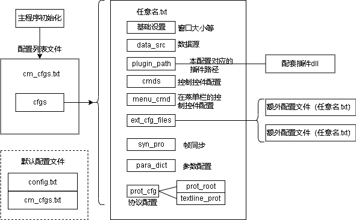

协议与配置  
======  
# 协议  
## 协议概念  
通信原始数据中数据的类型为源类型，决定程序以什么方式解析；  
程序参数的类型为目标类型，决定此参数以什么形式显示或处理。  
通用上位机支持的数据类型为：DataType类型：
```  
u8, u16, u32, u64,s8, s16, s32, s64, //整数
f, df, //浮点数float和double
undef, str //未定义和字符串
```  
## 通用文本行协议  
使用类nmea协议的形式，作为上位机的标准协议，其他协议使用适配器来适配。例如，下位机使用二进制协议时，上位机通过C语言dll外扩适配器，将文本协议转换为二进制协议与下位机交互。所以，上位机只需实现通用文本协议即可实现所有测控协议需求。  
协议规定：  
> - 数据由文本组成，文本分行，行分列。  
> - 每一行数据可以是不同的数据包类型，通过列数量或第一列文本决定数据包类型  
> - 使用行（\n）作为数据包的分割，对于指令，使用空格或tab作为参数的分割符。对于测量变量，使用空格、逗号、tab作为分隔符  
> - 行首第一列可以作为普通数据，也可作为协议标志，以$开头，接接协议名称。  
例如：  
```  
    1 2 3 4 5 6 7      是一个7列数据，若系统中没有其他数据包是7列，则可以通过列数唯一确定这个数据包类型
    $r,OK              是一个2列数据，第一列以$开头，则“r”为协议名称，通过“r”确定这个数据包的类型
```  
规定：  
指令配置时，可通过写入\n来做多个指令  
'$'开头的是与插件或下位机约定的文本协议  
'^'开头的是软件自身控制协议：  
	^clear         清除当前数据  
	^x_axis 总电压 x轴的索引，只有收到此变量后才增加曲线x轴坐标，若为空，则使用时间ms数作为x轴  

## 一般二进制协议  
一般情况下二进制协议头部具有同步头，尾部具有校验字，在靠近头部的区域有包类型或长度能够确定数据包的长度。可通过配置同步头、包长算法和校验的方式，实现变长二进制包的通用解析。  
# 配置  
软件可动态加载多个项目的配置和插件，所以在exe同目录下需要有cm_cfgs.txt文件，用于描述可选的配置。配置文件结构  
  
初始化时，首先清除上次配置。初始化测控体系结构，然后根据测控对象（MC_Prot : mc_prot）中的参数字典（ParaValue : para_dict），初始化界面参数显示字典（DataDes : dset）
## 参数列表:para_dict  
## 文本协议列表:textline_dict  
文本协议列表为一个数组，内容为协议（PD_LineObj）  
协议对象的配置包括：  
1. id：参数的唯一id，可不指定  
1. name：协议域名称,这里表示协议文本行第一列指定数据类型的字符串(唯一，或没有)  
1. col_n：此协议的列数，必填  
1. type：DataType类型  
1. ref_name：引用参数的名称  
1. split_char_list：本协议的特殊分隔符  
若此文本行的分隔符特殊，可配置split_char_list修改，但col_n只能按默认分隔符分割出来的列数来填  
## 二进制协议根:prot_root  
