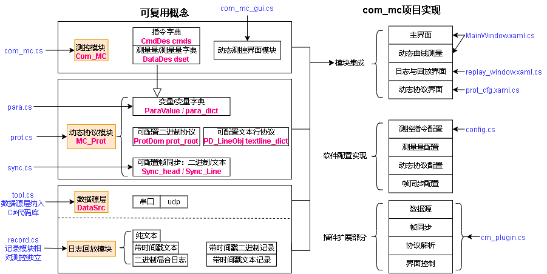
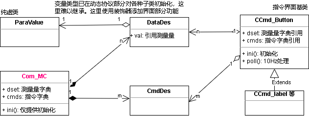
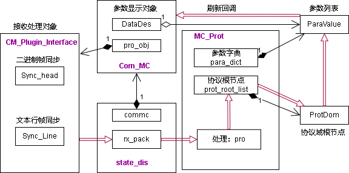

<link rel="stylesheet" type="text/css" href="base.css">

软件设计
====== 
## 开发组织
### 开发环境
上位机由C# wpf开发，基于.net framework 3.5以上，当前使用visual studio 2022  
文件编码为utf-8无bom；制表符缩进，长度为4；换行为\n  
### 文件组织  
<pre>
<b>com_mc</b>: C# wpf代码
	<b>app</b>: 应用代码
		cm_plugin.cs		实现插件的调用，默认处理对象的实现  
		tool.cs			通用工具
		frame_sync.cs		帧同步库
		record.cs		日志回放部分
		config.cs		软件配置的实现
	<b>mc</b>: 测控部分
		com_mc.cs		传感对象和指令对象的实现，界面无关，协议无关
		com_mc_gui.cs		控制控件的实现，与主程序无关  
		para.cs			参数变量的定义
		prot.cs			动态协议的定义
		sync.cs			帧同步配置定义
	<b>dlg</b>: 对话框文件
		help.xaml		帮助对话框
		replay_window.xaml	回放对话框
	<b>pic</b>: 存放软件引用的图片  
	state_dis.cs：		测控逻辑的适配，初始化曲线和状态的显示、初始化控制控件
	MainWindow:		主程序界面
<b>cm_plugin</b>: 示例插件代码
<b>doc</b>:	项目文档
<b>image</b>:  项目图片
<b>out</b>： 存放输出文件
	<b>cfgs</b>： 示例协议配置
	config.txt ： 默认配置文件，在运行时定义通用上位机的界面和协议
	cm_cfgs.txt ： 默认可选多种配置的配置文件
	com_mc.exe : 生成的可执行文件  
	cm_plugin.dll : 示例插件dll
	*.dll : 程序依赖的动态库
<b>com_mc.sln</b>：	项目解决方案入口  
</pre>
## 软件部署  
生成文件为com_mc.exe，默认配置文件为config.txt。一般只需这两个文件就可以执行，非常便携。  
具体部署规则参考[使用说明.md](使用说明.md)

## 程序结构  
### 测控概念结构
测控概念主要由几个大的部分组成：测控通信、动态协议、数据源、日志记录与回放。概念图如下：
  

### 测控部分
可复用的测控模块不包含应用部分，具体功能为：
1. 测量量字典：通过唯一的字符串名称索引测量变量
2. 指令字典：通过唯一的字符串名称索引指令
3. 指令界面定义：仅定义下发指令的控件，按钮、开关等
模块代码放在两个文件中：**com_mc.cs，com_mc_gui.cs**

  
### 动态协议部分
见[动态协议设计.md](动态协议设计.md)
### 数据源部分
软件支持多种数据源使用统一的接口实现数据输入，在运行时可选不同的数据源。  
1. 串口  
串口数据源初始化时可列出系统中的所有串口名称，加入数据源列表  
串口的模式仅支持无校验，8bit数据，1bit停止。波特率通过配置文件配置，软件运行时不可修改  
1. udp  
udp数据源通过配置文件指定本地和远程地址  
1. 回放  
通过日志回放模块虚拟数据源，触发软件的日志回放响应
### 日志记录与回放
#### 日志分类
软件可将上行数据保存成文件，形成日志记录。其中文本的数据存放在带时间戳的文本文件中，二进制数据存放在cmlog格式混合日志文件的信道1中
日志文件分为3种：无时间戳文本，带时间戳文本，cmlog混合日志。
> - **无时间戳文本**
	文本协议直接按行存储，软件不会记录这种格式，但可以回放这种格式，以最快的速度加载所有数据。所以曲线中的数据没有横坐标，需要在软件中通过指令配置横坐标的索引数据。 
> - **带时间戳文本**
	在每个文本协议行首加入"mmss.fff	"格式的时间戳（分秒.毫秒），tab分割。软件记录文本数据时使用此格式。
> - **cmlog混合日志**
	软件特有的日志格式，可由其他应用程序产生，通用测控软件读取。日志具有多个虚拟信道，可分别存储不同格式的日志。每个存储帧具有ms时间戳
#### cmlog日志格式
cmlog为二进制外包装，内部为数据流，存储任意结构的数据。分数据帧存储，
```
#pragma pack(1)
typedef struct //6Byte
{
	u8 syn; //0xA0 同步字
	u8 type		:1; //类型，0文本，1二进制
	u8 res		:3; //
	u8 vir		:4; //虚拟信道号
	u32 len		:8; //本行数据长度-1，0为1字节
	u32 ms		:24; //距离文件起始的ms数，在1小时内
} CMLOG_ROWHEAD; //混合日志行头
#pragma pack()
```
#### 回放结构

### com_mc实现结构
程序的模块：  
> - **MainWindow**: 组织界面逻辑，实现曲线控制，出10Hz定时器，调用处理流程  
> - **com_mc**：
	定义测控概念中的测量类：DataDes（数据描述），实现数据结构和协议处理
	定义测控概念中的控制指令类：CmdDes（指令描述） 
	定义通用测控类MC_Prot，组织测量对象字典（dset）、控制对象字典（cmds）
> - **com_mc_gui**: 定义测控概念中控制指令的界面显示类，实现各种形式的控制指令界面实现；测量方面，使用通用控件，所以没有定义。  
> - **state_dis**: 作为MainWindow的部分类实现，实现测控应用的逻辑：  
	组织测控概念中的对象，包括日志、界面中的曲线、测量控件等
	实现测量控件的构造
	实现控制控件的构造
	实现菜单控件的构造
	构造定时器，查询插件
	实现软件控制指令
	实现数据收发的处理

  
#### 插件机制
插件的接口包括：  
1. tx_cb: 向设备发送的回调函数（插件发送给主程序，主程序向设备发送）  
2. rx_cb: 上位机接收设备信息的回调函数（插件发送给主程序，主程序处理）  
3. rx_bin_cb: 上位机接收设备信息的回调函数（插件发送给主程序，主程序处理）  
4. ini: 初始化，注册回调函数  
5. fromJson: 从配置初始化，在ini之后  
6. send_cmd: 主程序发送指令（主程序发送给插件）  
7. rx_fun: 接收数据函数（主程序接收到设备的数据）  
8. so_poll_100: 周期调用,100Hz  
## 处理流程
### 上行流程
程序的调用源：
1. MainWindow的10Hz定时器，ui线程  
	曲线的添加删除  
	测量对象是否有数据的刷新：使用测量对象的update_dis回调  
控制对象的显示是引用了测量对象，所以测量对象的是否有数据刷新，以及数据状态刷新后，控制对象控件也就实现了刷新  
2. 用户的操作输入，ui线程  
	控制部分被动接受ui的调用，实现指令下发  
3. MainWindow的100Hz定时器threadTimer回调：OnTimedEvent，独立线程  
	用于调用插件的100Hz处理  
4. 数据源的接收线程  
	测量部分被动接收:  
> - 通过state_dis的rx_fun函数接收原始数据的输入  
> - 输入插件的rx_fun，经过插件的帧同步，输出rx_pack或rx_line回调  
> - 插件的回调函数中使用Invoke，通过主线程调用记录和协议处理：MC_Prot的pro和pro_line  
> - 二进制的情况：调用prot_root的处理函数，接下来递归调用各协议域的处理  
> - 文本的情况：构造协议名，在协议字典textline_dict中查询协议，按列处理  
	通过PD_Node的set_para_val函数，调用ParaValue_Val的set_val函数，实现赋值  
	通过update_cb实现界面刷新，包括显示和曲线添加点  

  
### 下行流程
### 回放流程
### 配置流程

## 日志与回放  
为了能够回放，日志的记录需要存储时间戳。而未经帧同步的数据难以加入时间戳，若按接收包加，则文本行可能被截断。所以日志的记录应该选在帧同步后  
对于二进制和文本数据的时间戳，很难统一。文本数据的记录要求按行，能够直接由文本编辑器编辑。所以应创建两种日志格式，分别记录、回放  
