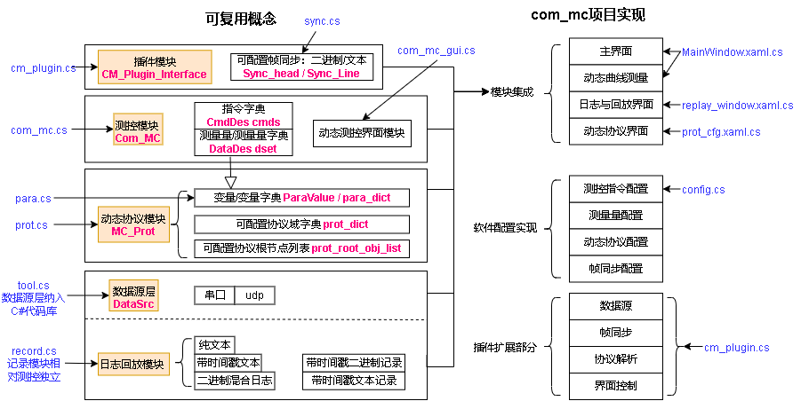

<link rel="stylesheet" type="text/css" href="base.css">

软件设计
====== 
[TOC]
## 开发组织
### 开发环境
上位机由C# wpf开发，基于.net framework 3.5以上，当前使用visual studio 2022  
文件编码为utf-8无bom；制表符缩进，长度为4；换行为\n  
### 文件组织  
<pre>
<b>com_mc</b>: C# wpf代码
	<b>app</b>: 应用代码
		cm_plugin.cs		实现插件的调用，默认处理对象的实现  
		tool.cs			通用工具
		frame_sync.cs		帧同步库
		log_tools.cs		日志数据转换的一系列工具
		record.cs		日志回放部分
		config.cs		软件配置的实现
	<b>mc</b>: 测控部分
		com_mc.cs		传感对象和指令对象的实现，界面无关，协议无关
		com_mc_gui.cs		控制控件的实现，与主程序无关  
		para.cs			参数变量的定义
		prot_ini.cs		动态协议的协议组织部分初始化
		prot_node.cs		动态协议的节点部分初始化及处理
		prot_pro.cs		动态协议的组织部分处理
		prot_text.cs		动态协议的文本部分初始化及处理
		sync.cs			帧同步配置定义及实现
	<b>dlg</b>: 对话框文件
		com_dlg.xaml	通用对话框，用于日志数据转换工具的简单输入
		help.xaml		帮助对话框
		replay_window.xaml	回放对话框
		prot_cfg.xaml	协议编辑对话框
	<b>pic</b>: 存放软件引用的图片  
	state_dis.cs：		测控逻辑的适配，初始化曲线和状态的显示、初始化控制控件
	MainWindow:		主程序界面
<b>cm_plugin</b>: 示例插件代码
<b>doc</b>:	项目文档
<b>image</b>:  项目图片
<b>out</b>： 存放输出文件
	<b>cfgs</b>： 示例协议配置
	<b>data</b>： 示例日志存储
	config.txt ： 默认配置文件，在运行时定义通用上位机的界面和协议
	cm_cfgs.txt ： 默认可选多种配置的配置文件
	com_mc.exe : 生成的可执行文件  
	cm_plugin.dll : 示例插件dll
	*.dll : 程序依赖的动态库
<b>com_mc.sln</b>：	项目解决方案入口  
</pre>
## 软件部署  
生成文件为com_mc.exe，默认配置文件为config.txt。一般只需这两个文件就可以执行，非常便携。  
具体部署规则参考[使用说明.md](使用说明.md)

## 主体结构  
### 测控概念结构
测控概念主要由几个大的部分组成：测控通信、动态协议、数据源、日志记录与回放。概念图如下：
  

### 测控部分
可复用的测控模块不包含应用部分，具体功能为：
1. 测量量字典：通过唯一的字符串名称索引测量变量
2. 指令字典：通过唯一的字符串名称索引指令
3. 指令界面定义：仅定义下发指令的控件，按钮、开关等
模块代码放在两个文件中：**com_mc.cs，com_mc_gui.cs**

  

此处应体现Com_MC、MC_Prot的层次关系
### 动态协议部分
动态协议的实现按职责分配到几个文件中：
1. **para.cs**：参数类的实现
2. **prot_cfg.cs**：协议配置读取
3. **prot_ini.cs**：协议组织类构造过程
4. **prot_pro.cs**：协议组织类处理过程
5. **prot_node.cs**：叶子节点，值、字符型、校验型等具体叶子节点
6. **prot_text.cs**：文本协议相关
### 数据源部分
软件支持多种数据源使用统一的接口实现数据输入，在运行时可选不同的数据源。  
1. 串口  
串口数据源初始化时可列出系统中的所有串口名称，加入数据源列表  
串口的模式仅支持无校验，8bit数据，1bit停止。波特率通过配置文件配置，软件运行时不可修改  
1. udp  
udp数据源通过配置文件指定本地和远程地址  
1. 回放  
通过日志回放模块虚拟数据源，触发软件的日志回放响应

数据源层通过抽象DataSrc类的静态域组织，List<DataSrc> dslist记录当前系统中的数据源列表，factory函数通过反射创建数据源，数据源的类命名规则为：cslib.DataSrc_开头。
数据源的对外接口：
1. 创建：构造函数传入void RX_CB(byte[] b)的回调函数，作为接收回调函数
2. 打开：open函数
3. 关闭：close函数
4. 获取此数据源内部端口名列表：get_names函数，例如获取系统中所有串口名
5. 发送：send_data函数
只需实现上述接口即可实现一个新的数据源。
### com_mc实现结构
程序的模块：  
> - **MainWindow**: 组织界面逻辑，实现曲线控制，出10Hz定时器，调用处理流程  
> - **com_mc**：
	定义测控概念中的测量类：DataDes（数据描述），实现数据结构和协议处理
	定义测控概念中的控制指令类：CmdDes（指令描述） 
	定义通用测控类MC_Prot，组织测量对象字典（dset）、控制对象字典（cmds）
> - **com_mc_gui**: 定义测控概念中控制指令的界面显示类，实现各种形式的控制指令界面实现；测量方面，使用通用控件，所以没有定义。  
> - **state_dis**: 作为MainWindow的部分类实现，实现测控应用的逻辑：  
	组织测控概念中的对象，包括日志、界面中的曲线、测量控件等
	实现测量控件的构造
	实现控制控件的构造
	实现菜单控件的构造
	构造定时器，查询插件
	实现软件控制指令
	实现数据收发的处理

### 插件机制
插件的接口包括：  
1. tx_cb: 向设备发送的回调函数（插件发送给主程序，主程序向设备发送）  
2. rx_cb: 上位机接收设备信息的回调函数（插件发送给主程序，主程序处理）  
3. rx_bin_cb: 上位机接收设备信息的回调函数（插件发送给主程序，主程序处理）  
4. ini: 初始化，注册回调函数  
5. fromJson: 从配置初始化，在ini之后  
6. send_cmd: 主程序发送指令（主程序发送给插件）  
7. rx_fun: 接收数据函数（主程序接收到设备的数据）  
8. so_poll_100: 周期调用,100Hz  
## 主体流程
数据上下行总体流程图：
  
### 上行流程
程序的调用源：
1. MainWindow的10Hz定时器，ui线程  
	曲线的添加删除  
	测量对象是否有数据的刷新：使用测量对象的update_dis回调  
控制对象的显示是引用了测量对象，所以测量对象的是否有数据刷新，以及数据状态刷新后，控制对象控件也就实现了刷新  
2. 用户的操作输入，ui线程  
	控制部分被动接受ui的调用，实现指令下发  
3. MainWindow的100Hz定时器threadTimer回调：OnTimedEvent，独立线程  
	用于调用插件的100Hz处理  
4. 数据源的接收线程  
	测量部分被动接收:  
> - 通过state_dis的rx_fun函数接收原始数据的输入  
> - 输入插件的rx_fun（commc.pro_obj），经过插件的帧同步，输出rx_pack回调  
> - 插件的回调函数中使用Invoke，通过主线程调用记录和协议处理：MC_Prot的pro
> - 与此同时进行记录，根据rec_mod进行记录，文本文件分为原始数据和带时间戳两种方式，都是rec_text对象进行记录；cmlog格式通过rec_bin_file记录。
	通过PD_Node的set_para_val函数，调用ParaValue_Val的set_val函数，实现赋值  
	通过update_cb实现界面刷新，包括显示和曲线添加点  
### 下行流程
下行过程一般由界面发起，只能配置文本指令。通过state_dis模块检查是否有软件配置指令，然后调用处理插件的send_cmd函数，由插件进行协议转换，若下发二进制协议，则在插件中转换为对应的二进制包，调用插件回调函数，通过当前数据源实现发送。
### 配置流程
## 日志记录与回放
### 日志分类
软件可将上行数据保存成文件，形成日志记录。其中文本的数据存放在带时间戳的文本文件中，二进制数据存放在cmlog格式混合日志文件的信道1中
日志文件分为3种：无时间戳文本，带时间戳文本，cmlog混合日志。
> - **原始数据 .org**
	无时间戳的数据直接存储，回放时，以最快的速度加载所有数据。所以曲线中的数据没有横坐标，需要在软件中通过指令配置横坐标的索引数据。 
> - **带时间戳文本 .ttlog**
	在每个文本协议行首加入"mmss.fff	"格式的时间戳（分秒.毫秒），tab分割。软件记录文本数据时使用此格式。
> - **cmlog混合日志 .cmlog**
	软件特有的日志格式，可由其他应用程序产生，通用测控软件读取。日志具有多个虚拟信道，可分别存储不同格式的日志。每个存储帧具有ms时间戳

记录日志的格式通过变量MainWindow的rec_mod（state_dis.cs中）来确定，定义为：0：不记录，1：原始数据记录，2：带时间戳文本，3：cmlog

### cmlog日志格式
cmlog为二进制外包装，内部为数据流，可存储任意结构的数据。分数据帧存储，数据帧内具有6Byte头部记录存储帧长，虚拟信道号、帧类型信息，用以从文件中解析各信道的数据流。
  
数据头格式如下，数据帧数据载荷最大长度65535字节，最大16个虚拟信道
```C++
#pragma pack(1)
typedef struct //8 Byte
{
	u8 syn; 	//0xA0 同步字
	u8 type		:1; //类型，0文本，1二进制
	u8 res		:3; //
	u8 vir		:4; //虚拟信道号（高4bit）
	u16 len; 	//本行数据长度
	u32 ms; 	//距离文件起始的ms数
} CMLOG_ROWHEAD; //混合日志行头
#pragma pack()
```
文件名中包含了本文件的记录起始时间，精确到秒。文件内部的记录帧只需记录在1小时以内的ms数。

为了方便记录，文本协议默认记录在0信道，二进制各根实体的数据按顺序从1信道开始记录。
### 记录流程
为了能够回放，日志的记录需要存储时间戳。而未经帧同步的数据难以加入时间戳，若按接收包加，则文本行可能被截断。所以日志的记录应该选在帧同步后  
文本格式/原始数据的记录使用LogFile rec_text，二进制记录使用cmlog格式，BinDataFile rec_bin_file。
在state_dis.cs中，rx_pack函数里，根据记录模式rec_mod进行记录。
### 回放结构
回放控制类DataSrc_replay是一个数据源类，在record.cs中定义。
> - open函数：分类打开数据文件，初步处理原始数据，形成易于访问的数据缓存
> - set_replay_pos函数设置回放位置
> - 支持suspend、resume、stop暂停、恢复、终止。

打开回放数据源后，会通过线程池提交回放线程任务。
回放数据源在打开时，加载文件的所有内容，并根据文件的类型进行解析，将时间戳、行信息存放在line_ms_list等变量中，用以回放。
  
其中回放的数据缓存为：
``` cs
byte[] 		org_data; //cmlog的原始数据记录
List<int> 	line_ms_list; //每一行的ms间戳
List<string> 	data_lines; //文本格回放数据缓存，若是二进制，则为hex显示数据
List<CMLOG_HEAD> line_cmlog_list; //cmlog的每一行的头
List<byte[]>	 bin_lines; //回放数据存(二进制)
```
回放数据源需要打开文件选择对话框，而界面相关功能不是回放业务的职责，所以在state_dis.cs中建立了DataSrc_replay_filedlg，进行适配。

回放对话框replay_window.xaml.cs仅实现交互控制逻辑，所有回放逻辑都在record.cs中实现。
### 回放流程
回放流程在回放线程中，流程通过状态机实现，状态变量为：state，0终止，1暂停，2回放，3单步
  
回放线程调用**try_to_play**函数实现回放，**try_to_play**内部会判断当前回放行的ms数与回放时刻，决定是否回放，一次调用会回放所有小于回放时刻的行。
**replay_run_1_frame**为回放一帧数据的函数。
回放过程中，可通过**set_replay_pos**设置回放位置，设置单位为行号。

回放的时间控制：
回放可选择不同的速度，回放原理是比较当前回放时刻（**replay_ms**）与各回放帧的ms时间戳，而**replay_ms**并不是以正常的时间速度增加的。
通过上次回放时间**pre_replay_ms**与当前时间的差，确定真实时间间隔，然后这个间隔乘以回放速度比例，得到回放时间增量，加到**replay_ms**上。
### 指定变量输出
回放数据的导出可通过回放的数据缓存，以及回放起止位置变量轻易的实现，但要实现指定变量的导出，就必须进行协议解析，完成解析后按指定的变量实现输出。
指定变量输出功能在回放对话框中以导出变量csv实现，回放对话框界面上会显示系统中的所有变量，通过CheckBox实现变量的选择，在**export_csv**函数中实现导出功能。
**export_csv**的流程如下：
  
输出时，首先输出csv行首，为每个变量的名称。且固定第一列为时间戳，单位ms。
### 日志数据导出
日志格式变换功能在record.cs: DataSrc_replay中实现。其类中定义export_org、export_cmlog、export_timetext函数，用于将当前选中的数据导出成不同的格式。由函数内部判断当前数据格式是什么。

由于原始数据回放是不经过回放流程的，所以这里当前数据类型都是带时间戳的文本或cmlog格式。
### 日志回放界面
回放界面有一个poll函数，由mainwindow以10Hz调用。用于刷新界面变量的值。分频至3.3Hz，在此将原始数据中的5行显示到原始数据文本框，每次都刷新，并不影响文本框的鼠标选择。
### 数据格式转换
在log_tools.cs：Log_Tools类中实现一系列数据格式转换功能。数据转换的参数输入使用通用对话框Com_Dlg来简化实现。
#### 导出成cmlog格式
#### 导出原始数据
#### 导出成ttlog格式
#### 将指定的参数导出成csv
#### cmlog修改基准时间戳
使用通用对话框Com_Dlg，加入TextBox来取得输入起始时间，单位ms。一次性读入所有数据，在写入过程中，每次只写一行。
#### hex原始数据转二进制
#### 二进制原始数据转文本
#### 原始数据转cmlog
#### cmlog文件合并
## 主界面组织
### 界面实现结构
mainwindow模块实现软件的界面和操作后台功能，测控数据部分放在state_dis模块中，以MainWindow的部分类的形式。mainwindow界面部分主要成员包括：
1. **chart1**：曲线控件
2. **rpl_win**：回放对话框，此对话框只实例化一次，关闭时为隐藏
3. **prot_win**：协议编辑对话框，此对话框只实例化一次，关闭时为隐藏
4. **ds_tab**：字符与数据源的对应关系，用于选择数据源时通过名称取得数据源对象
5. **timer10Hz**：辅线程定时器，10Hz

主界面首先加载配置列表：ConfigList.load，然后加载默认配置文件（配置列表的第一项）ini_by_config

在周期处理时，全部处理都invoke到主线程来做。处理包括：
1. 10Hz刷新每个参数
2. 10Hz对于每个控制控件，执行poll
3. 2Hz适应曲线显示范围
4. 1Hz更新接收字节速度
5. 5Hz查询曲线是否选中、查看记录模式
6. 10Hz日志模块poll
### 曲线控件
fit_screen_data遍历所有曲线，取得极值。set_chart1_range设置曲线显示区域。

set_legend显示每个曲线在当前鼠标点击处的值：输入为x轴坐标，遍历每一条曲线series_map，的每一个点，若此点大于游标，这是右侧点，找前一点作为左侧点，根据与两个点的间距对y值进行插值

鼠标操作，检测的事件有4个：
1. **鼠标按下**：
   为了解决不聚焦不能响应滚轮的问题，首先让控件聚焦；
   只处理左键按下，通过PixelPositionToValue从鼠标的像素位置换算成曲线显示区域的坐标位置，在此位置附近显示坐标值、显示十字线（游标）；
   显示与上次鼠标点击的位置（past_rx、past_ry，曲线物坐标）的差，并更新上次位置。
   记录左键按下时的像素位置：pre_left
2. **鼠标抬起**：
   为了防止左键框选范围太小，做判断，时间小于300ms或选择范围为0不处理
   将当前点与左键按下时的像素位置：pre_left转换为物坐标，设置曲线显示区域set_chart1_range
3. **鼠标移动**：
   只处理右键：将本次与上次（pre_m）鼠标移动的像素位置转换为物坐标，计算增量，加到显示区域上，设置曲线显示区域set_chart1_range
   更新pre_m（像素坐标）
4. **鼠标滚轮**：
	按1000分之一的比例，计算比例系数，范围限制在-0.5~0.5，将显示区域的长宽乘以比例，将与之前区域的长度差值加到上下左右极限值上，设置曲线显示区域set_chart1_range
	在更新新的长宽时，需要判断是否过大过小，过大是以2倍数据极值宽度为标准。过小是以x轴1，y轴0.1为标准。
### 参数部分
在state_dis.cs: mc_ini中初始化，根据commc.dset建立参数显示的控件，包括checkbox、曲线等。其中曲线的类型ChartType为SeriesChartType.FastLine，比Line要快很多。

为参数配置update_cb，在回调函数中设置显示控件，添加曲线显示。曲线的x轴有两种选择：
1是若有索引列，x_axis_id指示作为x轴的参数，此参数发生回调时，x轴坐标索引x_tick加1，其他参数回调时，依据x_tick添加曲线点。若本次值与上次值的变化小于0.1，就不更新值了。
2是若没有索引列，就用时间ms数作为x轴（ticks0 - st_ms）ticks0在接收完成时赋值。
曲线点的添加，若超过了曲线的最大点数（dis_data_len，可按每个参数配置不同的值），则删除曲线的第一个点。

为参数配置update_dis（周期刷新），包括两部分：1是update_times减1，2是根据update_times的有效性，改checkbox的背景颜色，实现参数有效性显示。

之所以回调要配置成2部分，是因为参数有是否显示is_dis的区别，不显示的参数不配置界面控件，但可以被指令控件引用，还是需要刷新时间和更新值的机制。
### 指令部分
#### 指令控件结构
指令部分界面逻辑在com_mc_gui.cs中定义，在state_dis.cs中初始化。指令控件的基类为：CCmd_Button，各控件继承基类进行差异编程。当前支持的指令控件类型包括：
``` Csharp
public enum CmdType //指令类型
{
	bt, //按键	CCmd_Button
	text, //文本框	CCmd_Text
	sw, //开关	CCmd_Switch
	rpl_bool, //带回复的指令	CCmd_rpl_bool
	label, //文本控件	CCmd_label
	para, //参数型	CCmd_para
}
```
指令控件通过CCmd_Button.bt_factory简单工厂实例化，要求在构造的时候就提供所引用的CmdDes和父控件。为了方便使用，在CCmd_Button类中定义了静态变量dset、cmds，引用通用测控类Com_MC的dset和cmds，这样，CCmd_Button体系只能单例存在，而Com_MC可以多例
#### 按键bt
使用基类CCmd_Button，实现普通按钮功能，点击时下发指定的指令。可配置周期发送，周期发送时，按钮处于checked状态。
#### 文本框text
CCmd_Text，实现数据输入功能，被其他控件引用。
#### 开关sw
CCmd_Switch，
#### 带回复的指令rpl_bool
CCmd_rpl_bool
#### 文本控件label
CCmd_label
#### 参数型para
CCmd_para
## 动态协议编辑UI
### 基础结构
动态协议的可视化通过一个对话框实现，对话框中通过DataGrid显示参数列表、协议列表、协议域根节点列表。并通过一个winform控件PropertyGrid实现具体对象的信息显示和编辑。

其中树形显示部分，使用类PEdit_Display，可用于参数和协议域的显示，参数显示就是列表显示，协议域显示为树形显示，此类通过create_recu函数递归建立数据结构。引用的变量包括：
1. 子节点列表，用于树形结构记录
2. 上级节点，用于引用上级的子节点，进行结构操作
3. 属性显示对象：用于在属性区域显示。

为了显示具体对象的属性描述，UI部分对动态协议部分类进行了装饰，建立继承路径一致的显示协议接口：Prop_Edit，接口中定义display_2_var函数，用于从属性显示控件中刷新回到后台变量。分为参数和协议两部分，互不关联的定义。

### 参数显示
由于参数不具有嵌套，结构简单，所以装饰类直接创建参数实体，进行显示。
### 协议结构显示
协议结构显示需要与配置文件中的协议结构配置相匹配，所以不能按实体来显示。由于具有嵌套结构，所以通过定义协议域的影子类，实现所有协议域类结构的显示定义，称为结构描述对象。

按结构描述对象显示需要解决几个问题：
1. **结构的长度计算**：可以在结构实例化的时候计算完成后，将len域补充到结构描述中。当加载结构显示时，就能读取到了
2. **嵌套对象的索引**：若是引用对象，则显示编辑时仅编辑字符串即可，这个字符串是相对路径引用的。若是嵌套协议域，是通过全局结构字典引用的，只需在结构字典里找即可。

结构的属性显示类中，具有的变量：
1. 嵌套定义结构的各种属性
2. 结构描述缓存：记录json字典的配置，采用引用的方式，在这里改动会直接影响协议配置数据

### 处理流程
#### 配置读入
#### 结果导出
#### 属性修改
#### 结构增删
