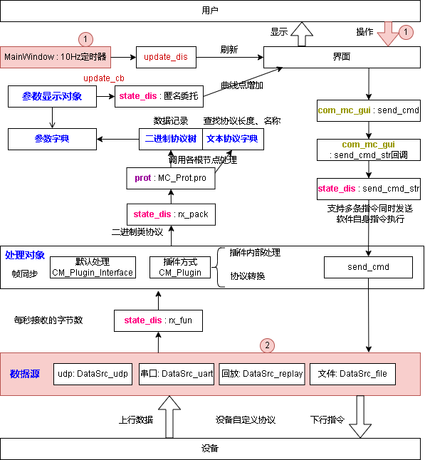

软件设计  
======
# 程序设计  
上位机由C# wpf开发，C#部分使用通用文本测控协议，对状态变量和指令进行描述和交互；使用协议适配器对设备实际协议进行适配。协议适配器为动态库，以cdecl方式调用。  
上位机加载适配器后，将串口数据以流的方式发送给适配器，适配器通过返回标志指示是否提取到了有效数据包，通过全局变量传递结果字符，以通用文本测控协议实现交互。  
## 文件组织  
```
com_mc: C# wpf代码  
	com_mc.cs：		传感对象和指令对象的实现，界面无关  
	com_mc_gui.cs：	控制控件的实现，与主程序无关  
	cm_plugin.cs:	实现插件的调用，默认处理对象的实现    
	textlog.cs:		文本日志模块  
	state_dis.cs：	测控逻辑的适配，初始化曲线和状态的显示、初始化控制控件  
	DataSrc.cs：	数据源，串口、udp  
	config.cs：		软件配置的实现
	dlg:			对话框文件，包括help对话框  
	pic:			存放软件引用的图片  
	MainWindow:		主程序界面
	replay_window:	回放界面实现
cm_plugin: 示例插件代码  
out： 存放输出文件  
	config.txt ： 程序的示例配置文件，在运行时定义通用上位机的界面和协议  
	config1.txt ： 程序的示例配置文件，在运行时定义通用上位机的界面和协议  
	com_mc.exe : 生成的可执行文件  
	cm_plugin.dll : 示例插件dll
	*.dll : 程序依赖的动态库  
image:  项目图片  
doc:	项目文档  
com_mc.sln：	项目解决方案入口  
```
## 程序部署  
生成文件为com_mc.exe，配置文件为config.txt。一般只需这两个文件就可以执行，非常便携。  
### 传感量  
传感量的显示包括值和刷新两部分，对于每个传感量，通过配置描述，指明其协议，以及解析方法  
传感量通过一个checkbox显示，粉色代表无刷新，绿色有刷新，打勾为显示曲线  
### 控制控件  
根据不同的控制变量，可以设置不同的控制按钮形式，以控件的方式实现配置，支持的控制控件包括：  
1. bt: 按键，单击发送指令，可配置引用文本框或参数编辑框作为指令的参数  
1. text: 文本框，为用户提供输入区域  
1. sw: 开关，可实现下发“开”“关”指令，同时显示当前传感量的状态是开是关  
1. rpl_bool: 带回复的指令，单击下发指令，在1s内收到回复，则高亮表示有反应。颜色表示回复的正确性  
1. label: 文本控件，可显示一个固定字符，或者空白，为布局填充  
1. para: 参数编辑框，带有刷新标志，点击刷新标志下发刷新指令，1s内回复，则刷新标志变绿  
## 程序结构  
程序的模块：  
> - MainWindow: 组织界面逻辑，实现曲线控制，出10Hz定时器，调用处理流程  
> - com_mc: 通用测控概念的定义  
	定义测控概念中的测量类：DataDes（数据描述），实现数据结构和协议处理
	定义测控概念中的控制指令类：CmdDes（指令描述）  
	定义通用测控类Com_MC，组织测量对象字典（dset）、控制对象字典（cmds）
> - com_mc_gui: 定义测控概念中控制指令的界面显示类，实现各种形式的控制指令界面实现；测量方面，使用通用控件，所以没有定义。  
> - state_dis: 作为MainWindow的部分类实现，实现测控应用的逻辑：  
	组织测控概念中的对象，包括日志、界面中的曲线、测量控件等
	实现测量控件的构造
	实现控制控件的构造
	实现菜单控件的构造
	构造定时器，查询插件
	实现软件控制指令
	实现数据收发的处理
## 处理流程  
程序的调用源：
1. MainWindow的10Hz定时器，ui线程  
2. 数据源的接收线程  
3. 用户的操作输入，ui线程  
> - 测量部分被动接收:  
	通过com_mc的update_data函数接收文本行输入数据  
		遍历所有dset，找到匹配的协议，对val接口赋值，实现文本转数值，并通过update_cb实现界面刷新，包括显示和曲线添加点  
> - 控制部分被动接受ui的调用，实现指令下发  
> - 由界面定时器驱动的周期处理程序，实现界面的处理：  
	曲线的添加删除  
	测量对象是否有数据的刷新：使用测量对象的update_dis回调  
控制对象的显示是引用了测量对象，所以测量对象的是否有数据刷新，以及数据状态刷新后，控制对象控件也就实现了刷新  

  

