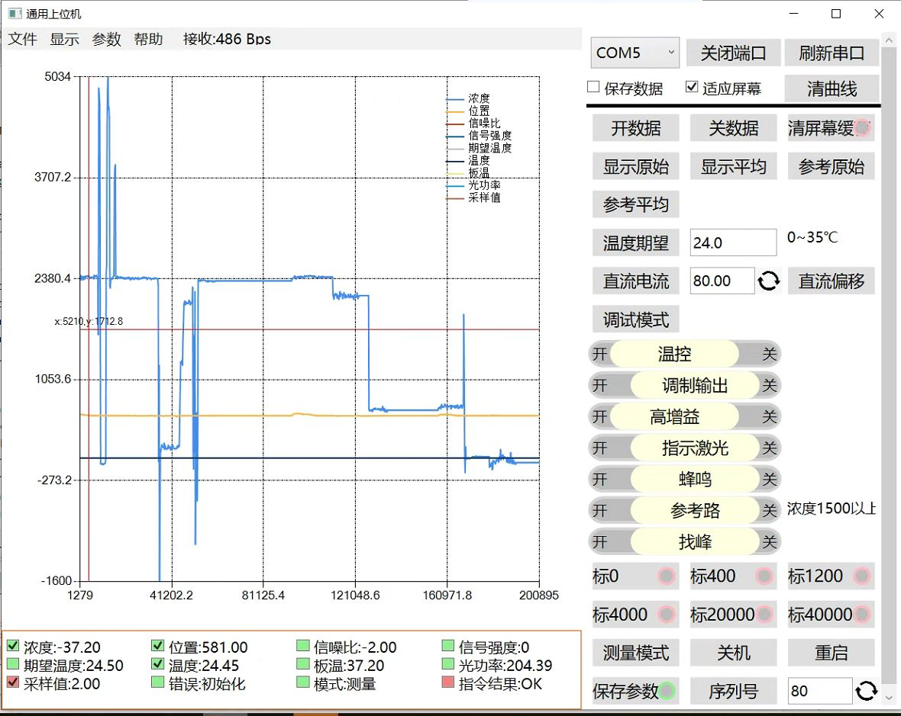
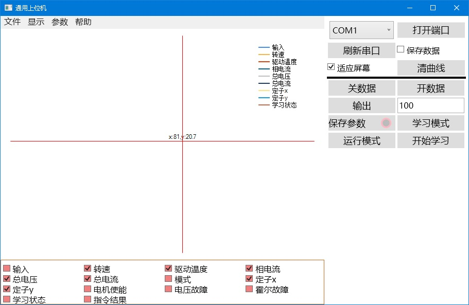
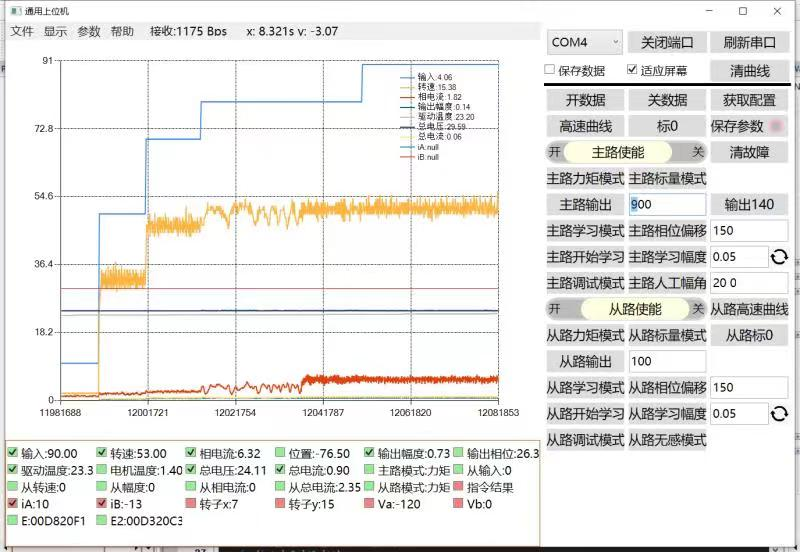

通用测控上位机
======
**串口曲线显示工具 udp控制**  
项目地址：  
https://github.com/yangzigy/com_mc  
https://gitee.com/yangzifb/com_mc  
bug反馈：yangzigy@sina.com  
# 功能  
嵌入式设备开发调试过程中，需要使用上位机查看设备状态，下达指令。使用曲线实现状态可视化，记录数据事后分析等功能能够大大提高开发调试效率。  
而不同的嵌入式设备，不同的项目，需要上位机控制的量完全不同，导致基本上每块电路都需要自己的上位机，这个工作量是难以承担的。实际项目中经常使用串口助手、串口数据曲线显示等通用工具，实现调试。但功能和通用性略差  
所以需要一款通用上位机，能够尽可能广泛的适应各种项目，各种设备的调试工作。  
1. 通过文本行方式对设备进行测控，包括状态上报和指令下达。协议易于描述  
2. 上传状态和下发指令的界面都通过配置文件描述，所以上位机可以在各项目间通用。  
3. 不仅实现曲线显示、变量显示、指令下达，还显示是否有数据刷新、指令是否有回复，回复是否正确  
4. 曲线显示不仅是图形，还通过游标实现特定位置的值显示、两点测距功能、区域缩放功能  
5. 具有数据记录/回放、曲线导出/导入功能  
例如如下几个项目中的上位机：  
  
  
  
均由本通用上位机软件的不同配置而成  
## 测控UI功能  
界面曲线显示区、传感值显示区、基础控制区和配置控制区，对参数的显示包括：  
1. 传感数值型：显示名称、数值、最近是否收到过数据、选择是否显示曲线  
2. 控制数值型：显示名称、期望值、结果是否成功  
3. 控制指令：显示名称、结果是否成功  
4. 开关型：显示名称、状态、最近是否收到过数据，无论当前状态是开还是关，都可以下达开和关的指令（即使在开的状态也可以下达开的指令）  
5. 参数型：显示名称、期望、当前值、最近是否收到过数据  
## 曲线功能  
1. 上位机为多个传感值显示曲线，每个曲线可实时选择显示、隐藏  
2. 曲线具有统一的纵坐标，横坐标可以使用次数和时间两种  
3. 曲线可按一定长度循环显示，可长期实时显示  
4. 曲线可保存、加载历史曲线  
5. 曲线显示界面可使用鼠标左键拖动框选一定的区域放大显示  
6. 曲线显示界面可使用鼠标滚轮实现缩放  
7. 曲线显示界面可使用鼠标右键拖动平移  
## 数据源  
上位机的数据源可以是串口、网络、日志回放等方式，以相同的方法实现数据输入、输出。  
上位机选择数据源，实现“打开”“关闭”操作，以方便的实现对端口的占用和释放  
数据源端口的配置在配置文件中，以免对UI造成不必要的需求  
# 文档  
见doc目录：  
| 文档 | 内容 |  
| ---- | ---- |  
| [使用说明.md](./doc/使用说明.md) | 软件使用说明，界面、曲线使用方法，配置组织  |  
| [软件设计.md](./doc/软件设计.md) | 软件结构和流程描述  |  
| [协议与配置.md](./doc/协议与配置.md) | 软件使用的通用文本行协议描述，协议配置，软件自身指令  |  
| [插件设计.md](./doc/插件设计.md) | 程序的插件扩展方法、原理  |  
| [数据源.md](./doc/数据源.md) | 软件支持的几种数据源及调用规则  |  
| [日志与回放.md](./doc/日志与回放.md) | 软件支持的带时间戳多种数据混合日志的设计和回放方法  |  
